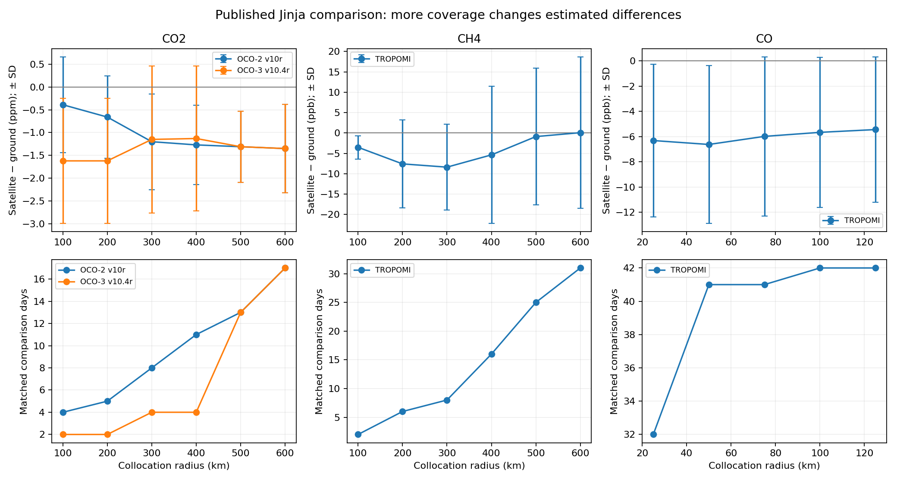

# Satellite–ground collocation sensitivity

**Miranda Nkwikah Finjap** · Independent reproducible portfolio study · October 2026

Reproduce quantitative radius tradeoffs in published OCO-2, OCO-3 and TROPOMI comparisons; build and test geometric/time filtering code.

## Run

Use Python 3.11 or newer. From this repository directory:

```bash
python -m venv .venv
source .venv/bin/activate
pip install -r requirements.txt
python analysis.py
python -m unittest discover -s tests -v
```

Windows activation: `.venv\Scripts\activate`. Data required for the main analysis
are bundled, so the analysis runs without downloading large files.

Open [notebook.ipynb](notebook.ipynb) in Jupyter or Google Colab to read the executed
walkthrough. When using Colab, upload/extract the entire repository and change to
its directory before running the notebook. `analysis.py` is the runnable source.

## Evidence and outputs

See [results/metrics.json](results/metrics.json) for measured results, `results/`
for figures and CSV outputs, and [data/PROVENANCE.md](data/PROVENANCE.md) for
sources, units and the distinction between observations and demonstrations.
Tests target scientific failure modes, rather than merely checking that files exist.

## Findings from the completed run

Reproduced **23 rows** from the published Tables B1–B3. At 300 km, the published OCO-2 difference is **−1.20 ± 1.05 ppm** across 8 comparison days; OCO-3 is **−1.15 ± 1.61 ppm** across 4 days. At 50 km, the published TROPOMI CO difference is **−6.62 ± 6.25 ppb** across 41 days. Signs are satellite minus ground and ± values are SD, not confidence intervals. These are the paper’s results, not new independently retrieved measurements.



## Scope and limitations

Analysis uses published summary tables. No new raw-satellite validation or mission-specific Level-0 to Level-2 processing is claimed. Matching code still needs mission QC, averaging kernels and prior harmonisation for a real validation campaign.

Climate/health relevance: greenhouse-gas monitoring and emissions analysis provide
climate context; none of these quantities directly estimates a person's exposure,
disease risk or health outcome.

## CV wording supported by this repository

Reproduced published satellite–EM27/SUN collocation-radius sensitivity results for CO2, CH4 and CO, and tested reusable spatial/temporal matching functions.

## Research ownership and review

This analysis was prepared collaboratively with coding assistance. All original
observations and published results remain credited to their data providers.
The researcher should reproduce the run, inspect the figures and understand the
methods before presenting the work in an interview or extending it for publication.
This repository is a portfolio study, not a peer-reviewed article.

Contact: miranda.finjap@aims-cameroon.org
